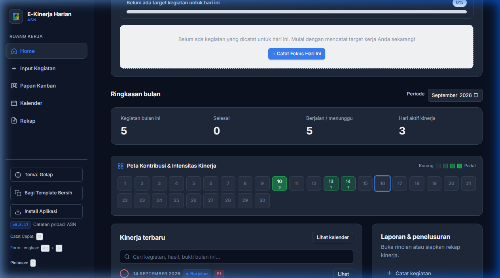
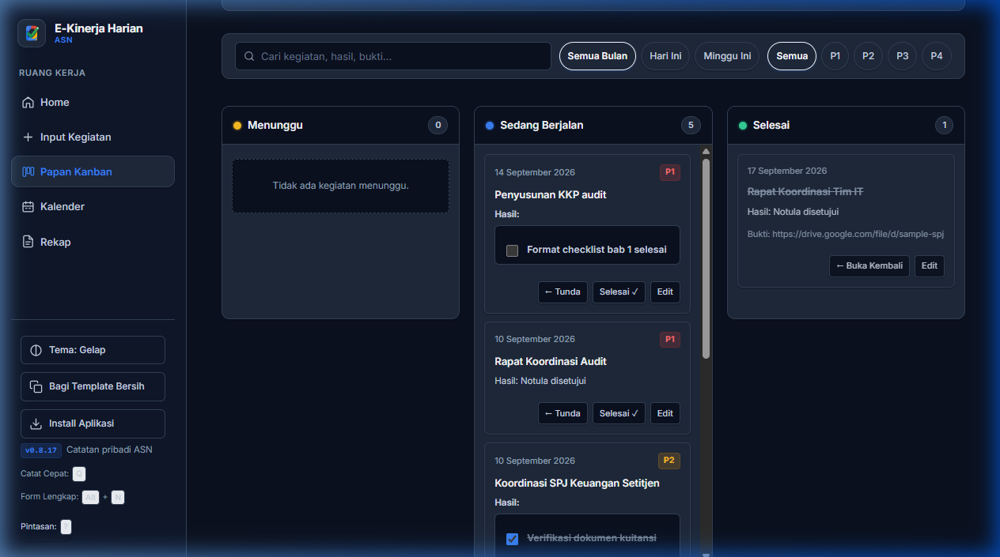
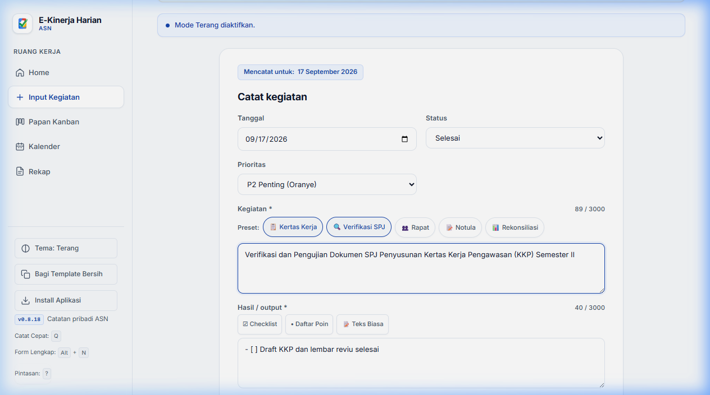
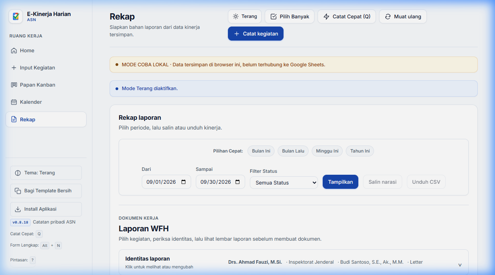
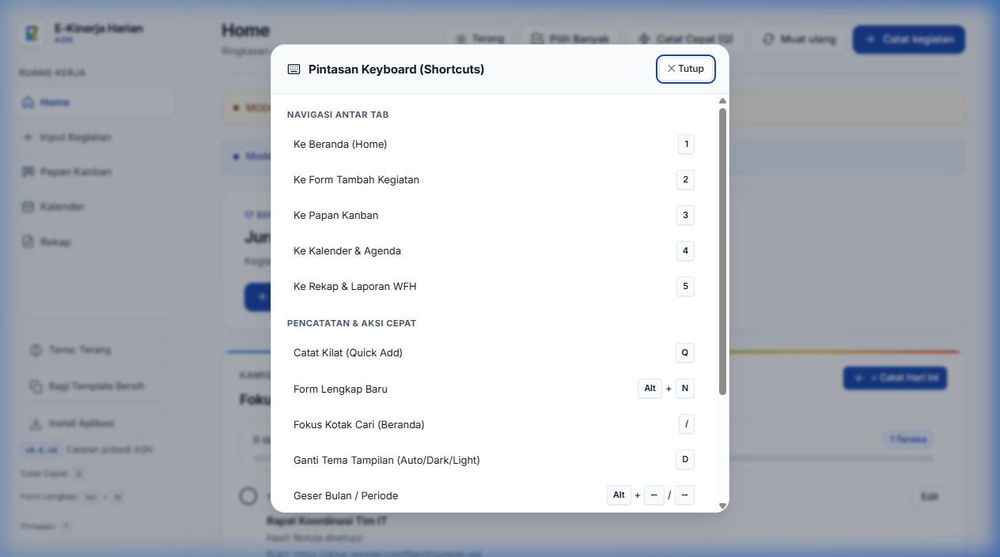
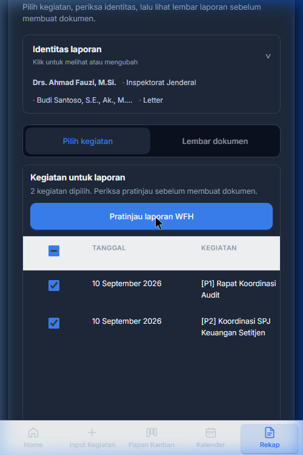

<div align="center">


# E-Kinerja Harian ASN

**Aplikasi pencatatan aktivitas kerja harian mandiri untuk ASN berbasis Google Sheets dan Google Apps Script.**  
*Cepat, responsif, privat, dan dirancang dengan standar estetika modern.*

[](CHANGELOG.md)
[](STATUS.md)
[](#pemasangan-pribadi)
[-brightgreen.svg?style=flat-square)](#build-dan-pengujian)
[](LICENSE)
[](#cuplikan-antarmuka-visual-showcase)

</div>

---

> [!NOTE]
> **Pemberitahuan Kepemilikan & Batasan:**  
> Aplikasi ini adalah alat bantu produktivitas mandiri yang berjalan di lingkungan Google Workspace pribadi Anda. Aplikasi ini **bukan** portal resmi BKN dan **bukan** sistem penilaian SKP formal instansi. Merek Google, Google Sheets, Google Drive, dan BKN adalah hak milik masing-masing pemilik.

---

## ✨ Cuplikan Antarmuka (Visual Showcase)

Aplikasi dirancang dengan panduan desain modern (Apple Human Interface Guidelines & Slate Dark Palette), menghadirkan visual bersih, kontras tinggi, dan animasi mikro yang halus untuk kenyamanan kerja sepanjang hari.

---

### 1. Dashboard Beranda & Peta Intensitas Kinerja (Activity Heatmap)
Tampilan beranda menyajikan ringkasan produktivitas harian dan bulanan secara komprehensif:
- **Indikator Fokus Harian & Streak**: Melacak konsistensi pengisian log kerja harian berturut-turut.
- **Peta Kontribusi & Intensitas Kinerja (Heatmap 30-Hari)**: Visualisasi intensitas beban kerja harian terinspirasi grid GitHub, dengan tooltip interaktif dan filter tanggal instan.
- **Pencarian Real-Time**: Temukan kegiatan berdasarkan kata kunci, hasil, atau bukti secara langsung tanpa memuat ulang halaman.

<div align="center">
  
</div>

---

### 2. Papan Alur Kerja Kanban (Kanban Triage Board)
Manajemen status kerja fleksibel dengan model 3 kolom terstruktur:
- **Triage Cepat**: Kolom *Menunggu*, *Sedang Berjalan*, dan *Selesai* untuk memantau progres tugas.
- **Badge Prioritas Visual**: Indikator prioritas (P1 Mendesak hingga P4 Rendah) berkode warna.
- **Sub-Checklist Interaktif**: Centang poin capaian tugas langsung pada kartu Kanban tanpa membuka modal edit.
- **Aksi Cepat**: Tombol *Tunda*, *Selesai*, dan *Edit* dalam satu klik.

<div align="center">
  
</div>

---

### 3. Formulir Catat Kegiatan & Chip Template ASN
Pencatatan kegiatan kerja kini lebih terstruktur dan efisien:
- **Chip Preset Kegiatan**: Tombol sekali klik untuk mengisi template jenis pekerjaan umum (Kertas Kerja, Verifikasi SPJ, Rapat Koordinasi, Notula, Rekonsiliasi).
- **Format Luaran Terpadu**: Dukungan format *Checklist*, *Daftar Poin*, dan *Teks Biasa*.
- **Penyimpanan Lampiran Aman**: Unggah bukti dukung (PDF, gambar, dokumen) langsung ke Google Drive privat dengan validasi MIME dan ukuran file.

<div align="center">
  
</div>

---

### 4. Ruang Kerja Rekap & Generator Laporan WFH
Penyusunan dokumen pertanggungjawaban kerja tanpa repot:
- **Pemilihan Kegiatan Fleksibel**: Pilih daftar kegiatan yang akan dicantumkan dalam laporan.
- **Pratinjau Lembar Dokumen**: Format tata letak dokumen standar kedinasan dengan kop surat dan identitas pegawai.
- **Ekspor Mandiri**: Buat Google Docs terformat rapi atau cetak PDF langsung dari lembar pratinjau.

<div align="center">
  
</div>

---

### 5. Pintasan Keyboard Power-User & 5-Second Undo
Navigasi secepat kilat untuk pengguna yang mengutamakan kecepatan:
- Tekan `?` kapan saja untuk membuka daftar pintasan keyboard.
- Navigasi angka `1`–`5` untuk beralih antar ruang kerja (Beranda, Form, Kanban, Kalender, Rekap).
- Catat Kilat dengan `Q`, Form Lengkap baru dengan `Alt + N`, dan cari dengan `/`.
- **5-Second Undo**: Pembatalan aksi perubahan status atau penyelesaian tugas dengan visual countdown bar (`Ctrl + Z`).

<div align="center">
  
</div>

---

### 6. Tampilan Responsif & Ramah Perangkat Bergerak (Mobile PWA)
Bekerja nyaman dari mana saja melalui smartphone atau tablet:
- **Bottom Navigation Bar**: Navigasi bawah jempol yang ergonomis di layar ponsel.
- **PWA Ready**: Dapat dipasang ke Home Screen layar smartphone dan mendukung Service Worker shell cache untuk pemuatan instan.

<div align="center">
  
</div>

---

## 🏛️ Arsitektur & Keamanan Data (Zero-Cost Serverless)

Aplikasi dibangun di atas arsitektur *Zero External Cloud Cost*. Seluruh data, script, dan file berada sepenuhnya di dalam ekosistem akun Google pribadi Anda:

```text
┌────────────────────────────────────────────────────────┐
│             Perangkat Anda (Browser / PWA)             │
│  HTML5 + CSS Apple Slate + Vanilla JS + Service Worker │
└──────────────────────────┬─────────────────────────────┘
                           │ Google Apps Script RPC
                           ▼
┌────────────────────────────────────────────────────────┐
│           Google Apps Script Engine (Server.gs)        │
│          Deployment Pribadi: Mode "Only Myself"        │
└──────────────┬──────────────────────────┬──────────────┘
               │ Spreadsheet Service      │ Drive Service
               ▼                          ▼
┌──────────────────────────────┐  ┌──────────────────────┐
│  Google Sheets (Database)    │  │  Google Drive Folder │
│  Tab: Catatan Harian (10 Kol)│  │  Bukti & Laporan PDF │
└──────────────────────────────┘  └──────────────────────┘
```

- **100% Kepemilikan Data**: Tidak ada server pihak ketiga, analitik pelacak, atau basis data eksternal.
- **Perizinan Terkunci Mandiri**: Deployment disetel ke mode `Only myself`, sehingga hanya akun Anda yang memiliki hak akses eksekusi.
- **Skema Data Kanonikal**: 10 kolom standar (`ID`, `Tanggal`, `Kegiatan`, `Hasil`, `Bukti`, `Status`, `Tindak lanjut`, `Dibuat`, `Diperbarui`, `Revisi`).

---

## 📦 Isi Paket Repositori

- `Kode.gs`: Bundle kompilasi tunggal siap tempel ke editor Google Apps Script.
- `appsscript.json`: Manifest izin aman dan deklarasi ruang lingkup web app pribadi.
- `Server.gs`, `Index.html`, `client-domain.js`, `client-sync.js`, `build.mjs`: Source code modular.
- `test.mjs` & `release-v0.3.1/regression.mjs`: Suite pengujian deterministik (75 suite regresi).
- `serve.mjs`, `sw.js`, `manifest.json`: Dukungan lingkungan pengembangan lokal dan fitur PWA.
- `assets/`: Koleksi ikon PNG multi-resolusi, vektor SVG, serta aset tangkapan layar antarmuka.
- `ASSET-PROVENANCE.md`: Ledger kepatuhan lisensi MIT dan verifikasi integritas hash SHA-256 seluruh aset.

---

## 🚀 Pemasangan Pribadi (5 Langkah Mudah)

1. **Siapkan Spreadsheet Kosong**  
   Buat Google Sheets baru di akun Google Anda. Atur zona waktu spreadsheet ke zona waktu wilayah Anda (`Asia/Jakarta`, `Asia/Makassar`, atau `Asia/Jayapura`).
2. **Atur Header Tab Data**  
   Ubah nama sheet pertama menjadi `Catatan Harian`. Isi baris pertama tepat dengan 10 kolom berikut:  
   `ID` | `Tanggal` | `Kegiatan` | `Hasil` | `Bukti` | `Status` | `Tindak lanjut` | `Dibuat` | `Diperbarui` | `Revisi`
3. **Buka Editor Apps Script**  
   Di spreadsheet, klik menu **Ekstensi → Apps Script**. Salin seluruh isi file [`Kode.gs`](Kode.gs) dan tempel ke editor kode. Buka **Pengaturan Proyek**, centang *Tampilkan file manifest "appsscript.json" di editor*, lalu ganti isinya dengan isi file [`appsscript.json`](appsscript.json).
4. **Inisialisasi Salinan**  
   Simpan proyek Apps Script, muat ulang tab spreadsheet Anda. Klik menu khusus **E-Kinerja ASN → Siapkan salinan ini**, lalu berikan persetujuan izin akun Google yang diminta.
5. **Deploy sebagai Web App**  
   Di editor Apps Script, klik **Deploy → New deployment**. Pilih jenis **Web app**:
   - **Execute as**: *Me (email Anda)*
   - **Who has access**: *Only myself* (hanya saya sendiri)  
   Buka URL `/exec` yang dihasilkan. Aplikasi siap digunakan!

---

## 🧪 Build dan Pengujian

Proyek ini dilengkapi dengan pipeline pengujian ketat untuk menjamin keandalan data dan fungsionalitas:

```bash
# Menjalankan build reproducible dan 75 kelompok tes deterministik
npm test

# Menjalankan verifikasi keamanan publik, audit allowlist, dan scan privasi
npm run verify:public

# Menjalankan server pengembangan lokal (http://127.0.0.1:8767)
npm run serve
```

---

## 📄 Lisensi & Integritas

- Kode sumber dan aset grafis asli didistribusikan di bawah [Lisensi MIT](LICENSE).
- Tipografi Inter dilisensikan di bawah [SIL Open Font License 1.1](https://github.com/rsms/inter/blob/master/LICENSE.txt).
- Audit integritas aset dan batasan hak cipta terdokumentasi lengkap di [ASSET-PROVENANCE.md](ASSET-PROVENANCE.md).
